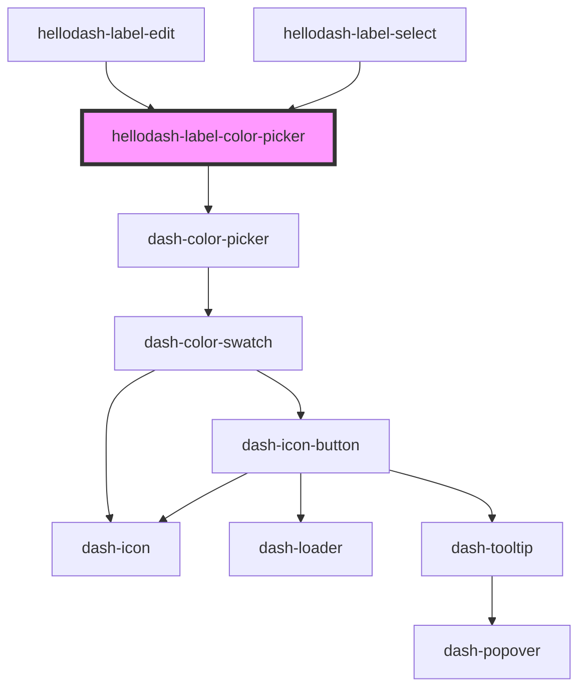

# hellodash-label-color-picker

<!-- Auto Generated Below -->

## Properties

| Property | Attribute | Description | Type                                                                                                                  | Default     |
| -------- | --------- | ----------- | --------------------------------------------------------------------------------------------------------------------- | ----------- |
| `color`  | `color`   | Color       | `"baby-blue" \| "dark-blue" \| "green-apple" \| "green-grass" \| "orange" \| "pink" \| "purple" \| "red" \| "yellow"` | `undefined` |

## Events

| Event                                   | Description | Type                                                                                                                               |
| --------------------------------------- | ----------- | ---------------------------------------------------------------------------------------------------------------------------------- |
| `hellodashLabelColorPickerColorChanged` |             | `CustomEvent<"baby-blue" \| "dark-blue" \| "green-apple" \| "green-grass" \| "orange" \| "pink" \| "purple" \| "red" \| "yellow">` |

## Dependencies

### Used by

 - [hellodash-label-edit](../hellodash-label-edit)
 - [hellodash-label-select](../hellodash-label-select)

### Depends on

- dash-color-picker

### Graph

----------------------------------------------

*Built with [StencilJS](https://stenciljs.com/)*
