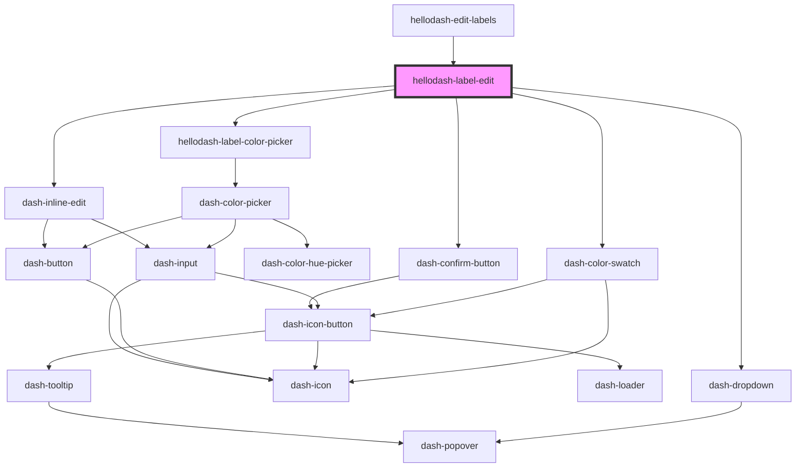

# hellodash-label-edit

<!-- Auto Generated Below -->

## Properties

| Property | Attribute | Description | Type    | Default     |
| -------- | --------- | ----------- | ------- | ----------- |
| `label`  | --        |             | `Label` | `undefined` |

## Events

| Event                            | Description | Type                 |
| -------------------------------- | ----------- | -------------------- |
| `hellodashLabelEditLabelDeleted` |             | `CustomEvent<Label>` |
| `hellodashLabelEditLabelUpdated` |             | `CustomEvent<Label>` |

## Dependencies

### Used by

 - [hellodash-edit-labels](../modals/hellodash-edit-labels)

### Depends on

- dash-dropdown
- dash-color-swatch
- [hellodash-label-color-picker](../hellodash-label-color-picker)
- dash-inline-edit
- dash-confirm-button

### Graph

----------------------------------------------

*Built with [StencilJS](https://stenciljs.com/)*
