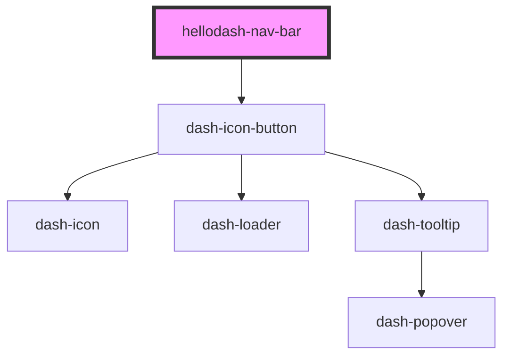

# hellodash-nav-bar

<!-- Auto Generated Below -->

## Events

| Event                  | Description | Type               |
| ---------------------- | ----------- | ------------------ |
| `hellodashMenuToggled` |             | `CustomEvent<any>` |

## Methods

### `setFocus() => Promise<void>`

Sets focus on the menu button

#### Returns

Type: `Promise<void>`

## Dependencies

### Depends on

- dash-icon-button

### Graph

----------------------------------------------

*Built with [StencilJS](https://stenciljs.com/)*
