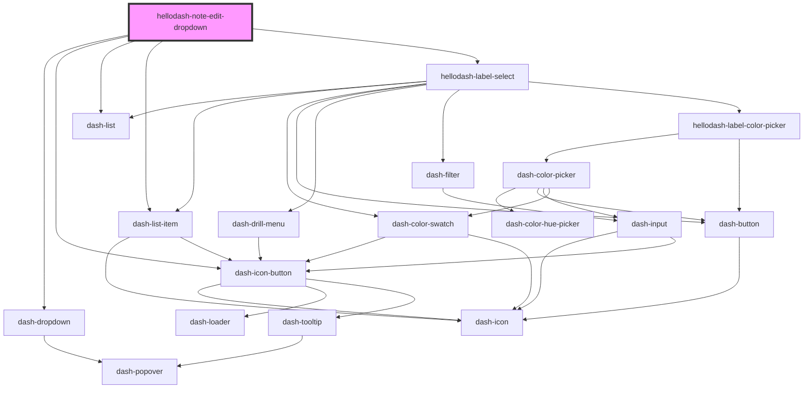

# hellodash-note-edit-dropdown

<!-- Auto Generated Below -->

## Properties

| Property    | Attribute | Description | Type      | Default     |
| ----------- | --------- | ----------- | --------- | ----------- |
| `allLabels` | --        |             | `Label[]` | `undefined` |
| `note`      | --        |             | `Note`    | `undefined` |

## Events

| Event                                     | Description | Type                   |
| ----------------------------------------- | ----------- | ---------------------- |
| `hellodashNoteEditDeleteNote`             |             | `CustomEvent<Note>`    |
| `hellodashNoteEditDropdownVisibleChanged` |             | `CustomEvent<boolean>` |
| `hellodashNoteEditDuplicateNote`          |             | `CustomEvent<Note>`    |
| `hellodashNoteEditLabelAdded`             |             | `CustomEvent<number>`  |
| `hellodashNoteEditLabelCreated`           |             | `CustomEvent<Label>`   |
| `hellodashNoteEditLabelRemoved`           |             | `CustomEvent<number>`  |
| `hellodashNoteEditLabelUpdated`           |             | `CustomEvent<Label>`   |

## Dependencies

### Depends on

- dash-dropdown
- dash-icon-button
- dash-list
- dash-list-item
- [hellodash-label-select](../../hellodash-label-select)

### Graph

----------------------------------------------

*Built with [StencilJS](https://stenciljs.com/)*
