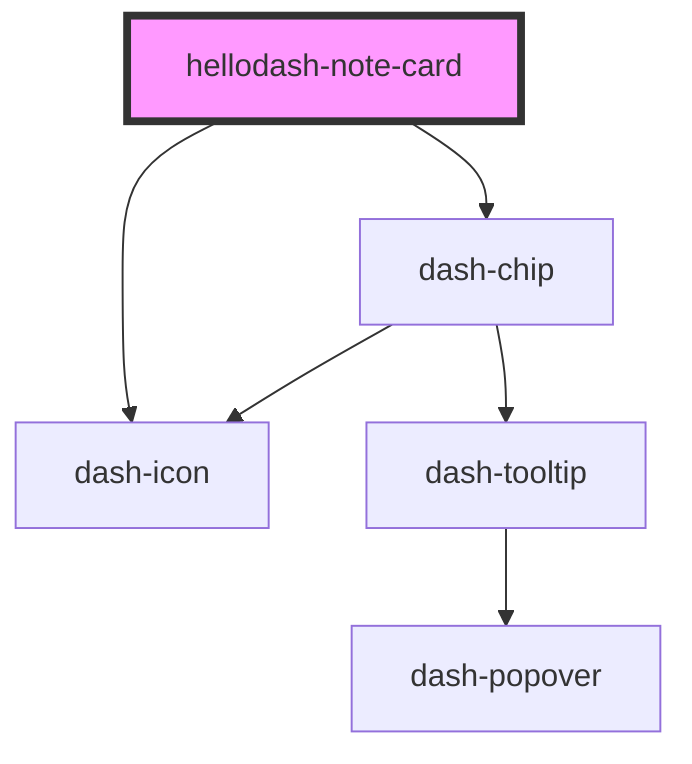

# hellodash-note-card

<!-- Auto Generated Below -->

## Properties

| Property     | Attribute  | Description                       | Type                     | Default     |
| ------------ | ---------- | --------------------------------- | ------------------------ | ----------- |
| `mode`       | `mode`     | Mode of the note card             | `"edit" \| "selectable"` | `'edit'`    |
| `note`       | --         | Note                              | `Note`                   | `undefined` |
| `noteLabels` | --         | Labels for note                   | `Label[]`                | `undefined` |
| `selected`   | `selected` | Whether the note card is selected | `boolean`                | `false`     |

## Events

| Event                           | Description | Type                |
| ------------------------------- | ----------- | ------------------- |
| `hellodashNoteCardNoteSelected` |             | `CustomEvent<void>` |

## Dependencies

### Depends on

- dash-chip
- dash-icon

### Graph

----------------------------------------------

*Built with [StencilJS](https://stenciljs.com/)*
