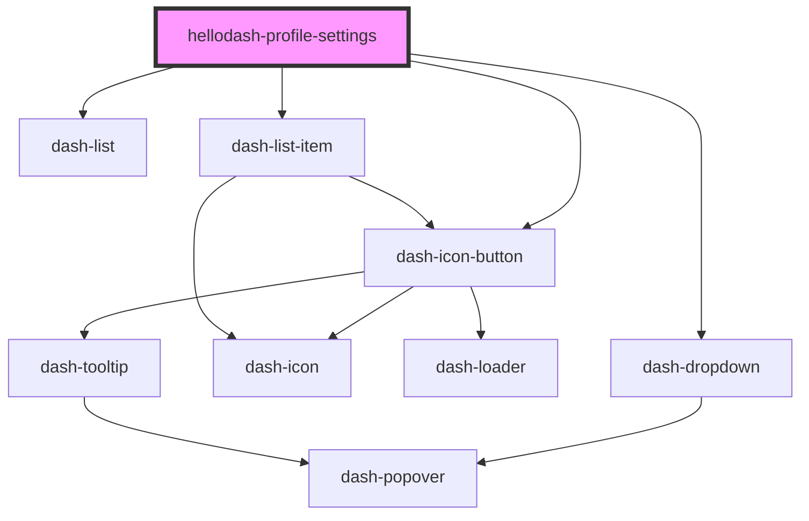

# hellodash-profile-settings

<!-- Auto Generated Below -->

## Properties

| Property | Attribute | Description | Type   | Default     |
| -------- | --------- | ----------- | ------ | ----------- |
| `user`   | --        |             | `User` | `undefined` |

## Events

| Event                            | Description | Type                |
| -------------------------------- | ----------- | ------------------- |
| `hellodashProfileSettingsLogout` |             | `CustomEvent<void>` |

## Dependencies

### Depends on

- dash-dropdown
- dash-icon-button
- dash-list
- dash-list-item

### Graph

----------------------------------------------

*Built with [StencilJS](https://stenciljs.com/)*
