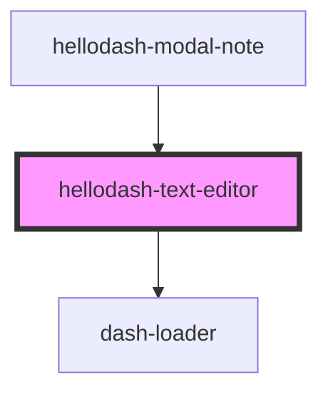

# hellodash-text-editor

<!-- Auto Generated Below -->

## Properties

| Property         | Attribute          | Description | Type                | Default     |
| ---------------- | ------------------ | ----------- | ------------------- | ----------- |
| `content`        | `content`          |             | `string`            | `undefined` |
| `debounce`       | `debounce`         |             | `number`            | `3000`      |
| `deferLoadTime`  | `defer-load-time`  |             | `number`            | `undefined` |
| `heading`        | `heading`          |             | `string`            | `undefined` |
| `loading`        | `loading`          |             | `boolean`           | `undefined` |
| `readonly`       | `readonly`         |             | `boolean`           | `undefined` |
| `resize`         | `resize`           |             | `boolean`           | `true`      |
| `showFullscreen` | `show-fullscreen`  |             | `boolean`           | `undefined` |
| `showTitleInput` | `show-title-input` |             | `boolean`           | `undefined` |
| `theme`          | `theme`            |             | `"dark" \| "light"` | `undefined` |

## Events

| Event                                  | Description | Type                                          |
| -------------------------------------- | ----------- | --------------------------------------------- |
| `hellodashTextEditorBeforeUnload`      |             | `CustomEvent<Promise<unknown>[]>`             |
| `hellodashTextEditorContentChanged`    |             | `CustomEvent<string>`                         |
| `hellodashTextEditorFullscreenChanged` |             | `CustomEvent<boolean>`                        |
| `hellodashTextEditorHeadingChanged`    |             | `CustomEvent<string>`                         |
| `hellodashTextEditorInit`              |             | `CustomEvent<HTMLHellodashTextEditorElement>` |
| `hellodashTextEditorIsDirty`           |             | `CustomEvent<any>`                            |
| `hellodashTextEditorNodeChanged`       |             | `CustomEvent<object>`                         |
| `hellodashTextEditorUnload`            |             | `CustomEvent<any>`                            |

## Methods

### `getContent() => Promise<string>`

#### Returns

Type: `Promise<string>`

### `getTextContent() => Promise<string>`

#### Returns

Type: `Promise<string>`

### `isEditorDirty() => Promise<boolean>`

#### Returns

Type: `Promise<boolean>`

### `save(emitEvent?: boolean) => Promise<void>`

#### Returns

Type: `Promise<void>`

### `selectTitle() => Promise<void>`

#### Returns

Type: `Promise<void>`

### `setFocus() => Promise<void>`

#### Returns

Type: `Promise<void>`

## Dependencies

### Used by

 - [hellodash-modal-note](../modals/hellodash-modal-note)

### Depends on

- dash-loader

### Graph

----------------------------------------------

*Built with [StencilJS](https://stenciljs.com/)*
