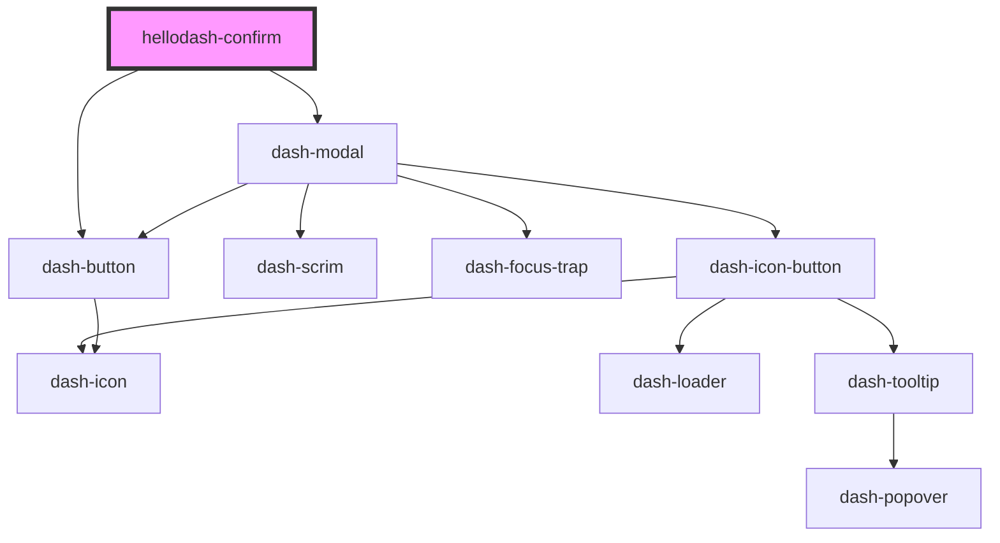

# hellodash-confirm

<!-- Auto Generated Below -->

## Properties

| Property              | Attribute               | Description | Type                   | Default     |
| --------------------- | ----------------------- | ----------- | ---------------------- | ----------- |
| `cancelText`          | `cancel-text`           |             | `string`               | `undefined` |
| `confirmButtonStatus` | `confirm-button-status` |             | `"error" \| "success"` | `'error'`   |
| `confirmText`         | `confirm-text`          |             | `string`               | `undefined` |
| `heading`             | `heading`               |             | `string`               | `undefined` |

## Events

| Event                       | Description | Type               |
| --------------------------- | ----------- | ------------------ |
| `dashModalBeforeClose`      |             | `CustomEvent<any>` |
| `dashModalClosed`           |             | `CustomEvent<any>` |
| `hellodashConfirmConfirmed` |             | `CustomEvent<any>` |

## Methods

### `close() => Promise<void>`

#### Returns

Type: `Promise<void>`

## Dependencies

### Depends on

- dash-modal
- dash-button

### Graph

----------------------------------------------

*Built with [StencilJS](https://stenciljs.com/)*
