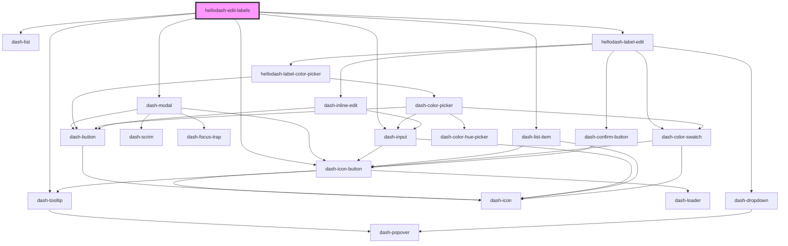

# hellodash-edit-labels

<!-- Auto Generated Below -->

## Properties

| Property        | Attribute        | Description | Type      | Default     |
| --------------- | ---------------- | ----------- | --------- | ----------- |
| `creatingLabel` | `creating-label` |             | `boolean` | `undefined` |
| `labels`        | --               |             | `Label[]` | `[]`        |

## Events

| Event                                | Description | Type                                            |
| ------------------------------------ | ----------- | ----------------------------------------------- |
| `dashModalBeforeClose`               |             | `CustomEvent<any>`                              |
| `dashModalClosed`                    |             | `CustomEvent<any>`                              |
| `hellodashEditLabelsCreateLabel`     |             | `CustomEvent<{ color: string; text: string; }>` |
| `hellodashEditLabelsDeleteLabel`     |             | `CustomEvent<Label>`                            |
| `hellodashEditLabelsLabelsReordered` |             | `CustomEvent<Label[]>`                          |
| `hellodashEditLabelsUpdateLabel`     |             | `CustomEvent<Label>`                            |

## Methods

### `close() => Promise<void>`

#### Returns

Type: `Promise<void>`

## Dependencies

### Depends on

- dash-modal
- dash-input
- dash-icon-button
- dash-tooltip
- dash-list
- dash-list-item
- [hellodash-label-edit](../../hellodash-label-edit)

### Graph

----------------------------------------------

*Built with [StencilJS](https://stenciljs.com/)*
