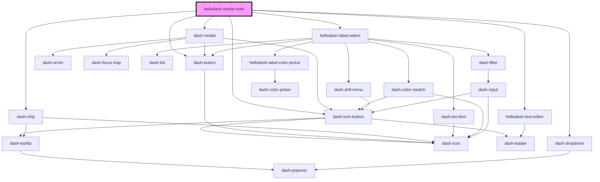

# hellodash-modal-note

<!-- Auto Generated Below -->

## Properties

| Property              | Attribute               | Description                    | Type                | Default     |
| --------------------- | ----------------------- | ------------------------------ | ------------------- | ----------- |
| `allLabels`           | --                      |                                | `Label[]`           | `undefined` |
| `createLabelDisabled` | `create-label-disabled` |                                | `boolean`           | `undefined` |
| `loading`             | `loading`               |                                | `boolean`           | `undefined` |
| `mobileView`          | `mobile-view`           |                                | `boolean`           | `undefined` |
| `note`                | --                      |                                | `Note`              | `undefined` |
| `open`                | `open`                  | When `true`, the modal is open | `boolean`           | `undefined` |
| `theme`               | `theme`                 |                                | `"dark" \| "light"` | `'dark'`    |

## Events

| Event                            | Description | Type                 |
| -------------------------------- | ----------- | -------------------- |
| `dashModalBeforeClose`           |             | `CustomEvent<any>`   |
| `dashModalClosed`                |             | `CustomEvent<any>`   |
| `hellodashModalNoteLabelCreated` |             | `CustomEvent<Label>` |
| `hellodashModalNoteLabelUpdated` |             | `CustomEvent<Label>` |
| `hellodashModalNoteUpdateNote`   |             | `CustomEvent<Note>`  |

## Methods

### `close() => Promise<void>`

#### Returns

Type: `Promise<void>`

## Dependencies

### Depends on

- dash-modal
- [hellodash-text-editor](../../hellodash-text-editor)
- dash-chip
- dash-dropdown
- dash-icon-button
- [hellodash-label-select](../../hellodash-label-select)
- dash-button

### Graph

----------------------------------------------

*Built with [StencilJS](https://stenciljs.com/)*
